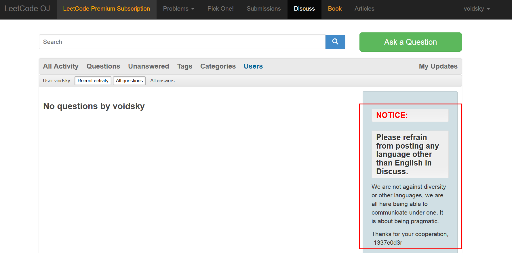

 By [Voidsky(黄锴）](https://github.com/hk029)

---
# 写在前面
>本人一直有写书的“小梦想”，机缘巧合碰到gitbook，也算看缘分，虽然我知道这本“书”远达不到想象中的书的概念，但是，我仍然视其我第一本书。尽管它不能出版，也不会被人广泛阅读，但却值得我小心呵护。我希望通过自己的努力能慢慢的让这本"不是书的书"变得丰满起来。也算是给我最后这段校园时光留下点什么印记。

2015-05-05:
>今天，突然发现leetcode上我写的所有的中文思路贴都被删了，心情还是有些低落，我看见了站长对我的“善意提醒”，他说的也没错，毕竟是在别人的地盘。

>不过，在短短几天，我看见了大家对我的支持，我很感动，也许没机会再在leetcode上用中文发思路了，但是我还是想坚持把这本书完成，虽然不一定会有很多人看了，怎么说呢，坚持吧！

# LeetBook介绍

>LeetBook电子书的地址：[https://www.gitbook.com/book/hk029/leetbook/details](https://www.gitbook.com/book/hk029/leetbook/details)

LeetBook理论上不是一本书，它是我做leetcode已来的一些笔记，总结。

本“书”不是一蹴而就的，是本人在刷题过程中做的笔记逐步积累起来的，并会随着我的刷题而变得丰富。

每道题后面的[E][M][H]代表了这个题的难度等级，分别是轻松，略有难度，很难

**强调：**本人并不是什么大神，只是喜欢整理归纳，喜欢把别人的思维转换成自己更易懂的形式。在刷题过程中，会有很多自己的解题思路和感想，也会有很多灵光一现的瞬间，我习惯用马克飞象（一个支持印象笔记的第三方markdown编辑器)把这些瞬间捕捉下来，所以我很多笔记都存在印象笔记中。而偶然间遇到gitbook，又刚好支持markdown，这也促成就是这本书的诞生。

# LeetBook怎么看
这本“书”你可以横着看，竖着看，躺着看（开玩笑了），怎么看取决于你了，我讲讲我是怎么组织这本书的：
- 我在第二页写了一个目录，包含了所有收录的题目，你可以从这里入手，查找你需要的题目找踢解
- 我把题型分类了，我会**选择**一部分我觉得能学到点东西的题目放在这里面，你可以通过侧栏寻找感兴趣的。

# 为什么要写做这个？
我相信很多为了找工作都开始刷LeetCode了，我也不例外，LeetCode目前应该是找工作领域最权威的刷题网站了，上面的题目都很有代表性，也是很多公司喜欢问的，所以也成就了现在刷LeetCode的狂热。

但是，很多人都发现了一个问题，只是一味的刷题，却没有机会对每个题目做一个整理或总结。导致题目做过一遍，但是没什么印象，很多题目虽然A过了，但是实际上用的是比较笨，或者比较费时的思路，有更多更精彩，更简单的思路没有考虑到。导致一遍下来收获并不大。

所以这里推出这本书，一方面，方便大家A题后来复习看看，也方便大家来这里找每道题新的思路。也督促自己对每道题尽可能的想全面点。

# 这本书力求做到
1. 覆盖尽可能多的题目
2. 每道题力求多种思路解决
3. 解答思路尽可能清晰，易懂

这也算对自己的一个鞭策，每道题让自己考虑出更加容易理解的思路，也方便日后的复习。

# 声明
1. 它不是一本算法或数据结构书，这毕竟是一本有关解题思路的“书”，它默认你是有一定的算法和数据结构基础的，如果你在这方面还十分欠缺，推荐你看下下面相关推荐的书（我以后有时间可能会结合自己的能力加上每类题型的讲解，相关算法等）
2. 关于语言，这里不推荐任何语言，我觉得语言只是工具，思路才是最重要的，所有的思路其实都可以快速的用特定的语言实现，大多就是语法上的细微区别，我觉得大家还是不要把注意力放在特定的实现上。我也不会在解题的时候拘泥于特定的语言，之前我大部分是使用c++，但是有些题目用python确实方便我也会用python，之后我A题主要使用java(考虑以后工作可能会用java),
2. 这本“书”目前是我一个人闲暇时间完成，所以更新速度上不会特别快，大概每周4-6篇，跟我这周做题时间有关。

# 相关推荐
- 书籍推荐(以下链接都是豆瓣读书的链接，可以方便你了解详情)
  1. [《算法》](https://book.douban.com/subject/10432347/)（红宝书，书内有能运行的代码，大量图示，而且讲解的通俗易懂，作者是普林斯顿大学计算机学院院长，Kuth的徒弟，算法界的牛人！这里我不打算推荐算法导论，因为它太深了，不适合以找工作为目的的同学）
  2. [《大话数据结构》](https://book.douban.com/subject/6424904/)（数据结构就推荐这本，国内教材都过于悔涩，这个适合自学）
  3. [《编程珠玑》](https://book.douban.com/subject/3227098/)（你会很明确知道什么叫精华）
  4. [《编程之美》](https://book.douban.com/subject/3004255/)（微软的面试宝典）
  5. 待续
- 博客推荐
  1. [blog.csdn.net/hk221976](blog.csdn.net/hk221976) （不要脸的先推荐了自己的博客 -- 捂脸）
  2. [http://www.nowamagic.net/](http://www.nowamagic.net/) 简明现代魔法原本是一个个人博客，现在已经发展成一个清新的、动漫风的、专注于将Web开发技术尽可能简明易懂地描述出来的IT社区,在这里你可以轻松愉快地学习Web开发技术。

# 关于评论
目前已经加上了评论功能，可以在每一页的底部发现输入评论。可以用自己的社交账号登录，评论功能由多说提供支持。

# 联系我
毕竟是自己一个人的工作，虽然每道题我都力求做到完善。但是可能还是会出现一些不足，如果有什么问题或建议，可以联系我：

- 黄锴
  - 邮箱   [hk2291976@hotmail.com](hk2291976@hotmail.com)
  - CSDN博客 [blog.csdn.net/hk221976](blog.csdn.net/hk221976)
  - 微信 justme029
  - qq 263791865

# 更新情况
##1.1版本
1. 加入katex,支持Latex算数表达式

2. 加入了多说评论插件，可以支持评论

3. 目前题目更新到21题

##1.0版本
这是最原始的版本，完善了首页介绍和书的框架，加入了目前整理的解题思路