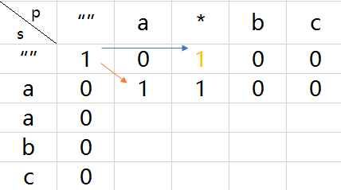
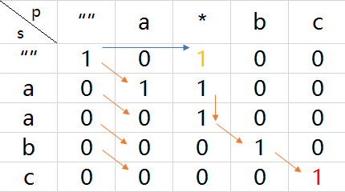
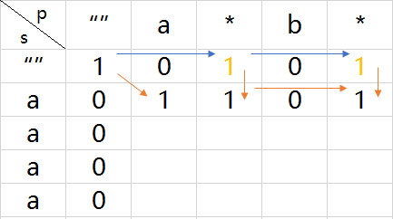

010. Regular Expression Matching
---

 @(leetcode解题思路)[DP]
 
#**问题**
Implement regular expression matching with support for '.' and '*'.

>'.' Matches any single character.
'*' Matches zero or more of the preceding element.

>The matching should cover the entire input string (not partial).

>The function prototype should be:
bool isMatch(const char *s, const char *p)

>Some examples:
isMatch("aa","a") → false
isMatch("aa","aa") → true
isMatch("aaa","aa") → false
isMatch("aa", "a*") → true
isMatch("aa", ".*") → true
isMatch("ab", ".*") → true
isMatch("aab", "c*a*b") → true


#思路

这里面最复杂的操作是"\*"，这是个很可恶的操作，因为你永远不知道它多长。但是有一点，"\*"不会单独出现，它一定是和前面一个字母或"."配成一对。看成一对后"X*"，它的性质就是：要不匹配0个，要不匹配连续的“X”

题目的关键就是如何把这一对放到适合的位置。

考虑一个特殊的问题：
情况1：
“aaaaaaaaaaaaaaaa"  
"a*aa*"

情况2：
“aaaaaaaaaaaaaaaa"  
"a*ab*"

在不知道后面的情况的时候，我如何匹配a*？
- 最长匹配
	显然不合适，这样后面的a就无法匹配上了
	
- 匹配到和后面长度一样的位置，比如情况1，就是留3个a不匹配，让后面3个字母尝试去匹配。
	这样看似合适，但是遇到情况2就不行了。
- 回溯，每种"*"的情况我都匹配一次，看哪种情况能成功，如果其中出现了问题，马上回溯，换下一种情况


##思路1——回溯
如果“\*”不好判断，那我大不了就来个暴力的算法，把“*”的所有可能性都测试一遍看是否有满足的，用两个指针i,j来表明当前s和p的字符。
我们采用<font color=red>从后往前匹配</font>，为什么这么匹配，<font color=blue>因为如果我们从前往后匹配，每个字符我们都得判断是否后面跟着“*”，而且还要考虑越界的问题。但是从后往前没这个问题，一旦遇到“\*”，前面必然有个字符。</font>

- 如果j遇到"\*"，我们判断s[i] 和 p[j-1]是否相同，
	- 如果相同我们可以先尝试匹配掉s的这个字符，i--，然后看之后能不能满足条件，满足条件，太棒了！我们就结束了，如果中间出现了一个不满足的情况，马上回溯到不匹配这个字符的状态。
	- 不管相同不相同，都不匹配s的这个字符，j-=2 (跳过“\*”前面的字符)
```c++
if(p[j-1] == '.' || p[j-1] == s[i])
    if(myMatch(s,i-1,p,j))
	    return true;
    return myMatch(s,i,p,j-2);
```
- 如果j遇到的不是“*”，那么我们就直接看s[i]和p[j]是否相等，不相等就说明错了，返回。

```c++
    if(p[j] == '.' || p[j] == s[i])
         return myMatch(s,i-1,p,j-1);
	else return false;
```
- 再考虑退出的情况
	- 如果j已经<0了说明p已经匹配完了，这时候，如果s匹配完了，说明正确，如果s没匹配完，说明错误。
	- 如果i已经<0了说明s已经匹配完，这时候，s可以没匹配完，只要它还有"\*"存在，我们继续执行代码。


所以代码应该是这样的：

```c++
class Solution {
public:
    static const int FRONT=-1;
    bool isMatch(string s, string p) {
        return myMatch(s,s.length()-1,p,p.length()-1);
    }
    bool myMatch(string s, int i, string p,int j)
    {
        if(j == FRONT)
            if(i == FRONT)    return true;
        else return false;
        if(p[j] == '*')
        {
            if(i > FRONT && (p[j-1] == '.' || p[j-1] == s[i]))
                if(myMatch(s,i-1,p,j))
                    return true;
            return myMatch(s,i,p,j-2);
        }
        if(p[j] == '.' || p[j] == s[i])
            return myMatch(s,i-1,p,j-1);
        return false;
    }
};

```

##思路2——DP
DP的话，肯定要用空间换时间了，这里用 monkeyGoCrazy 的思路：用2维布尔数组，dp[i][j]的含义是s[0-i] 与 s[0-j]是否匹配。

>1. p.charAt(j) == s.charAt(i) :  dp[i][j] = dp[i-1][j-1]
>2. If p.charAt(j) == '.' : dp[i][j] = dp[i-1][j-1];
>3. If p.charAt(j) == '*': here are two sub conditions:
	   - if p.charAt(j-1) != s.charAt(i) : dp[i][j] = dp[i][j-2]  //in this case, a* only counts as empty
	   - if p.charAt(i-1) == s.charAt(i) or p.charAt(i-1) == '.':
                        dp[i][j] = dp[i-1][j]    //in this case, a* counts as multiple a 
						dp[i][j] = dp[i][j-1]   // in this case, a* counts as single a
                        dp[i][j] = dp[i][j-2]   // in this case, a* counts as empty


这里用的bool数组比较巧妙，初始化为true。前两种情况好理解，如果匹配成功就维持之前的真假值。程序的目的是看真值能不能传递下去。如果遇到三种情况，我们就看哪种情况有真值可以传递，就继续传递下去。


##初始化
```c++
 dp[0][0] = true;
//初始化第0行,除了[0][0]全为false，毋庸置疑，因为空串p只能匹配空串，其他都无能匹配
for (int i = 1; i <= m; i++) 
	dp[i][0] = false; 
//初始化第0列，只有X*能匹配空串，如果有*，它的真值一定和p[0][j-2]的相同（略过它之前的符号）
for (int j = 1; j <= n; j++) 
    dp[0][j] = j > 1 && '*' == p[j - 1] && dp[0][j - 2];
```
##图示
我用excel自己跑了下代码，画了一下示意图，下面橘黄色表示正常匹配了，蓝色表示“\*”匹配空串。可以看出真值是如何传递下去的。

 <font color=blue>例1："aaa" 和 正则式"aa"


 <font color=blue>例2："aabc" 和 正则式"a\*bc"







 <font color=blue>例3："aaaa" 和 正则式"a\*b\*"





#代码执行
```c++
for(int i = 1;i <= n;i++)
{
	for(int j = 1;j <= m;j++)
	{
		//这里j-1才是正常字符串中的字符位置
		//要不*当空，要不就只有当前字符匹配了*之前的字符，才有资格传递dp[i-1][j]真值
		if(p[j-1] == '*')
			dp[i][j] = dp[i][j-2] || (s[i-1] == p[j-2] || p[j-2] == '.') && dp[i-1][j];
		else 
		//只有当前字符完全匹配，才有资格传递dp[i-1][j-1] 真值
			dp[i][j] = (p[j-1] == '.' || s[i-1] == p[j-1]) && dp[i-1][j-1];
	}
}

```

##返回值
```c++
return dp[n][m]
```

##完整代码
```c++
class Solution
{
public:
    static const int FRONT=-1;
    bool isMatch(string s, string p)
    {
        int m = s.length(),n = p.length();
        bool dp[m+1][n+1];
        dp[0][0] = true;
//初始化第0行,除了[0][0]全为false，毋庸置疑，因为空串p只能匹配空串，其他都无能匹配
        for (int i = 1; i <= m; i++)
            dp[i][0] = false;
//初始化第0列，只有X*能匹配空串，如果有*，它的真值一定和p[0][j-2]的相同（略过它之前的符号）
        for (int j = 1; j <= n; j++)
            dp[0][j] = j > 1 && '*' == p[j - 1] && dp[0][j - 2];

        for (int i = 1; i <= m; i++)
        {
            for (int j = 1; j <= n; j++)
            {
            //由于表格中是从1开始的，而字符串中是以0开始的，所以i-1和j-1才对应字符串中的字符。
                if (p[j - 1] == '*')
                {
                    dp[i][j] = dp[i][j - 2] || (s[i - 1] == p[j - 2] || p[j - 2] == '.') && dp[i - 1][j];

                }
                else   //只有当前字符完全匹配，才有资格传递dp[i-1][j-1] 真值
                {
                    dp[i][j] = (p[j - 1] == '.' || s[i - 1] == p[j - 1]) && dp[i - 1][j - 1];

                }
            }
        }
        return dp[m][n];
    }
};
```

