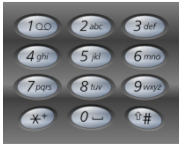

017. Letter Combinations of a Phone Number[M]
---
#问题
Given a digit string, return all possible letter combinations that the number could represent.

A mapping of digit to letters (just like on the telephone buttons) is given below.


>Input:Digit string "23"
Output: ["ad", "ae", "af", "bd", "be", "bf", "cd", "ce", "cf"].

#分析

这题其实含义是是枚举所有可能的组合方式。如果题目要求是枚举“23”的所有可能字母组合，我们很好做，2重循环对吧？但是现在难就难在，一开始你不知道输入是什么，你没办法确定组合长度，组合个数，也没办法确定循环层数，这时候怎么办？？？

这里有两个思路，也是很常用的思路：递归，队列。
#思路1：递归
递归一般是解决一些整体不好求的问题。它通过把大问题划小，然后找到一种特定的规律，然后求解。递归的思路我们很好理解，我们没办法确定整体，我可以先从入手。假定有个数字串“23456”
- 假定除了数字'2'外，后一串数字的组合我已经求出来了，那我只要把‘2'所代表的'abc'加到他们每一个的前面就好。所以现在只用求数字串"3456"
- 假定'3'之后一串数字的组合我已经求出来了，那我只要把‘3'所代表的'def'加到他们每一个的前面就好。所以现在只用求数字串"456"
……
- 一直这样推下去，直到发现6'后面是空的了，那返回它代表的每个字母就好了。

递归这里直接引用annafan的代码。

```java
public class Solution {
        public static List<String> letterCombinations(String digits) {
            String digitletter[] = {"","","abc","def","ghi","jkl","mno","pqrs","tuv","wxyz"};
            List<String> result = new ArrayList<String>();

            if (digits.length()==0) return result;

            result.add("");
            for (int i=0; i<digits.length(); i++) 
                result = combine(digitletter[digits.charAt(i)-'0'],result);

            return result;
        }

        public static List<String> combine(String digit, List<String> l) {
            List<String> result = new ArrayList<String>();

            for (int i=0; i<digit.length(); i++) 
                for (String x : l) 
                    result.add(x+digit.charAt(i));

            return result;
        }
    }
```


#思路2：用队列
队列的思路也不算太难理解。如果递归算纵向求解的话，队列就是横向求解。每加入一个新的数字的时候，就把当前队列的元素全都扩充一遍。使得队列不仅在长度上，也在宽度上增加了。这就像一个装配流水线。半成品每流过一个工人，工人就把之前的产品拿出来，往上安装一个零件，然后放到传送带上，让它继续传到下个工人那。

1. 一共需要的工人数，就是数字串长度，它决定了产品需要经过几道加工
```
 for(int i = 0;i < digits.length(); i++)
 {
 }
```
2. 然后我们看目前有多少个不同的半成品需要加工
```
 int pos = digits.charAt(i) - '0';
 int size = result.size();
 for(int j = 0;j < size;j++)
 {
 }
```

3. 然后就开始加工了，我们获取每个数字对应的字符串长度，这就是工人需要加工的零件个数。这里加工是把每个半成品拿出来，复制多份，然后按上新的零件
```
  String tmp = result.remove();
  for(int k = 0;k < map[pos].length();k++)
	    result.add(tmp+map[pos].charAt(k));
```

##整体代码

```java
public class Solution {
    public List<String> letterCombinations(String digits) {
        LinkedList<String> result = new LinkedList<String>();
        if(digits.length() == 0)
            return result;
        String[] map = new String[] {"0", "1", "abc", "def", "ghi", "jkl", "mno", "pqrs", "tuv", "wxyz"};
        result.add("");
        for(int i = 0;i < digits.length(); i++)
        {
            int pos = digits.charAt(i) - '0';
            String s = map[pos];
            int size = result.size();
            for(int j = 0;j < size;j++)
            {
                String tmp = result.poll();
                for(int k = 0;k < s.length();k++)
                    result.add(tmp+s.charAt(k));
            }
        }
        return result;
    }
}
```

这里，我用了size变量来存之前加工好的半成品个数（因为队列会在加工后扩充，size会变化），

	int size = result.size();
	for(int j = 0;j < size;j++)


但是，高分答案中有个思路，我觉得很赞。（要是想不到这个，就用我上面的写就好了，多一行代码而已）

	while(ans.peek().length()==i)

这里ans.peek().length()是取出第一个元素的长度，当长度等于i的时候，说明是当前需要加工的半成品，而加工完后，队列中的每个元素长度都会增加1，所以，这时候循环就会停止。

